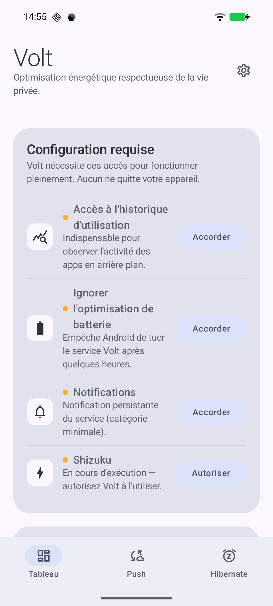
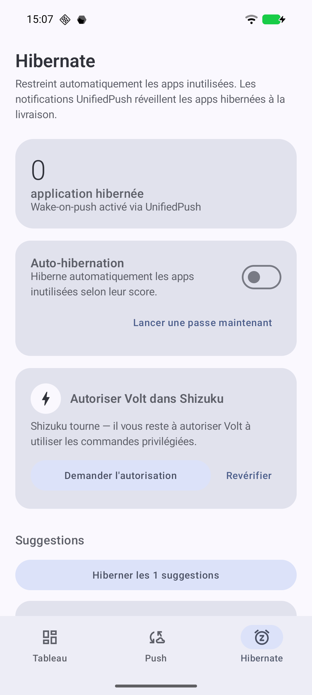
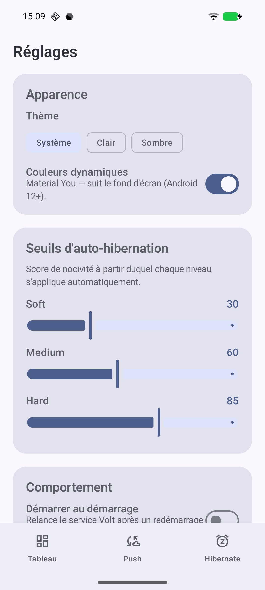
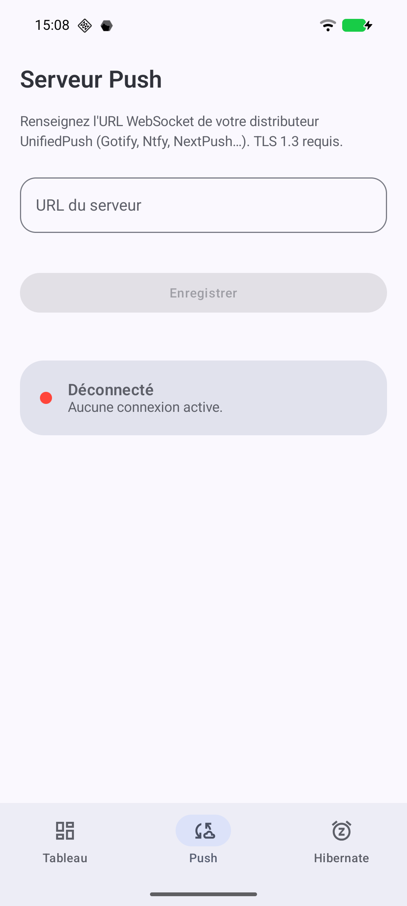

# ⚡ Volt — Privacy-first power suite for GrapheneOS

> **The FOSS successor to Greenify** — intelligent app hibernation, no root, with UnifiedPush wake-on-push.
> Built for Android 14/15/16, tested on GrapheneOS / Pixel 8.

[](LICENSE)
[]()
[]()
[](https://grapheneos.org)
[]()
[](https://github.com/lebiggg/volt/actions/workflows/build.yml)

---

## 📸 Screenshots

| Dashboard | Hibernate | Settings | Push |
|---|---|---|---|
|  |  |  |  |

*(Shown in French — the app defaults to English and follows your system language.)*

---

## ✨ What Volt does

### 1. 🔋 Hibernate — the core module

Automatically detects unused, battery-draining apps, hibernates them in graduated levels, and guarantees **notifications keep arriving** thanks to UnifiedPush wake-on-push.

- **0–100 nocivity score** per app, broken into 5 transparent components (inactivity, background ratio, CPU wakeups, background network, battery impact). No opaque score — tap it to see the breakdown.
- **5-layer automatic whitelist**: system apps, critical roles (dialer, SMS, launcher), active keyboard, accessibility services, password managers, known 2FA apps, VPNs. Signal, Aegis, Bitwarden & co. are protected by default.
- **3 levels**: SOFT (RESTRICTED bucket), MEDIUM (+ force-stop on screen off), HARD (+ periodic 6h sweep).
- **Auto-hibernation**: configurable score thresholds drive automatic hibernation on a periodic sweep — or run a pass on demand.
- **Wake-on-push**: `FLAG_INCLUDE_STOPPED_PACKAGES` delivers the push even to a force-stopped app — something Greenify never did cleanly.
- **Battery savings estimate**, **"wake all"** panic button, **Quick Settings tile**.

### 2. 🔎 Forensics — "why did my battery drain overnight?"

A scanner that ranks the apps that woke your phone and used the network while you slept, over a configurable window (4 / 8 / 12 / 24h).

- **Per-app wakeup attribution** parsed from `dumpsys batterystats` via Shizuku (`wakeupap=` history) — validated against real Android 16 output.
- **Foreground transitions** (UsageStatsManager) and **background network** (NetworkStatsManager) folded into one 0–100 impact score.
- **One-tap hibernate** straight from a culprit row.
- Honest degradation: without Shizuku, wakeup data is shown as "?" and only foreground + network signals are used.

### 3. 📡 UnifiedPush hub — *experimental*

Persistent WebSocket (TLS 1.3, full-jitter backoff, zero payload logging) to the push server of your choice (NextPush, Gotify, ntfy…).

> ⚠️ **Current state**: the WebSocket channel and routing work, but the UnifiedPush registration protocol (`REGISTER`/`UNREGISTER`) is **not implemented yet**. Volt can't declare itself as a system distributor to other apps yet. Treat this as a technical demo, not a production distributor.

---

## ⚠️ Requirement: Shizuku (read before installing)

**On Android 16, Volt requires [Shizuku](https://shizuku.rikka.app) to work.** This is not a design choice — it's an OS constraint: Google locked the `CHANGE_APP_IDLE_STATE` permission (`not a changeable permission type`), and it's no longer grantable via `adb pm grant`. The only remaining app-level path to manipulate App Standby Buckets is Shizuku, which runs under the `shell` UID.

Shizuku requires **no root**, but needs a one-time setup (via wireless debugging or a PC). Volt guides you step by step in the Dashboard tab.

| Android | Shizuku |
|---|---|
| ≤ 15 | optional (reflection path to `setAppStandbyBucket` still works) |
| **16+** | **required** for any hibernation |

---

## 🚀 Install (≈ 10 min, no compiling)

### 1. Install Volt
Download the latest APK from [**Releases**](../../releases) → install it (1 tap). No Android Studio needed.

### 2. Install + start Shizuku
- Install [Shizuku from F-Droid](https://f-droid.org/packages/moe.shizuku.privileged.api/)
- Start it via **wireless debugging** (no PC) — [official guide](https://shizuku.rikka.app/guide/setup/)

### 3. Configure Volt
- Open Volt → **Dashboard** tab → grant the requested access (the onboarding adapts and disappears once everything is green)
- **Hibernate** tab → authorize Volt in Shizuku → pick your apps

### Build from source (developers)

```bash
git clone https://github.com/lebiggg/volt
cd volt
./gradlew :app:assembleDebug
adb install app/build/outputs/apk/debug/app-debug.apk
```

---

## 🔐 Permissions — full transparency

Zero telemetry. No network connection beyond the outgoing UnifiedPush WebSocket **you** configure.

| Permission | Type | Why |
|---|---|---|
| `INTERNET` | normal | Outgoing UnifiedPush WebSocket |
| `FOREGROUND_SERVICE_DATA_SYNC` | normal | Persistent network service |
| `POST_NOTIFICATIONS` | runtime | Minimal service notification |
| `PACKAGE_USAGE_STATS` | special access | Nocivity score (UsageStatsManager) |
| `QUERY_ALL_PACKAGES` | normal | List installed apps |
| `REQUEST_IGNORE_BATTERY_OPTIMIZATIONS` | normal | Service longevity |
| `RECEIVE_BOOT_COMPLETED` | normal | Opt-in start on boot (off by default) |

The privileged action (`am set-standby-bucket`) goes through **Shizuku**, not a direct Volt permission.

---

## 🏗️ Architecture

```
ui/screens/             Dashboard | Push | Hibernate (3 tabs) + Settings
ui/theme/               Dynamic Material You (GrapheneOS-friendly)

BatteryCommandService   dataSync foreground service, FLAG_INCLUDE_STOPPED_PACKAGES
PushConnectionManager   OkHttp WebSocket, full-jitter backoff, zero payload logging
ScreenStateReceiver     ACTION_SCREEN_ON/OFF → triggers the sweep
BootReceiver            opt-in service start on boot
VoltTileService         "Hibernate now" Quick Settings tile

data/hibernation/
├── HibernationController       Single facade (idempotent, thread-safe, Shizuku-first)
├── HibernationDecisionEngine   Score → level
├── AutoHibernationRunner       Wires the engine to the periodic sweep
├── HibernationRepository       Entity ↔ Policy bridge (Room)
├── HibernationWorker           Periodic 6h sweep (WorkManager)
├── SavingsEstimator            Indicative battery savings model
├── nocivity/NocivityScorer     0-100 score in 5 components
├── whitelist/WhitelistResolver 5-layer protection
├── shizuku/ShizukuGateway      am set-standby-bucket / force-stop via Shizuku
└── persistence/                Room database

VoltContainer           Minimal service locator (no Hilt)
```

Every bucket operation goes through **one point**: `HibernationController`. That's the central invariant — a single file to touch if the system API changes.

---

## 🧪 Tests

```bash
./gradlew :app:testDebugUnitTest      # pure-JVM models (30 assertions)
./gradlew :app:connectedAndroidTest   # integration (device required)
```

CI runs build + unit tests on every push via GitHub Actions.

### Manual verification (Pixel 8 / GrapheneOS / Android 16)

```bash
# Prereq: Shizuku started and Volt authorized.
# Verify an app moves to the restricted bucket after hibernation:
adb shell am get-standby-bucket org.fdroid.fdroid    # → 45 (RESTRICTED) after a SOFT in Volt
```

---

## 🤝 Contributing

See [CONTRIBUTING.md](CONTRIBUTING.md).

### Adding an app to the curated whitelist

Missing a 2FA / password manager / encrypted messenger in [`CuratedWhitelist.kt`](app/src/main/java/com/tonnomdeved/volt/data/hibernation/whitelist/CuratedWhitelist.kt)? Open a PR with the `packageName`, the source-repo link, and a justification.

---

## 🛡️ Threat model

**Volt assumes**: an up-to-date GrapheneOS device, a user willing to set up Shizuku once, a trusted UnifiedPush server.

**Volt does not protect against**: a physical attacker with ADB access, a network MITM without certificate pinning (enable it manually in `PushConnectionManager`), an app that roots itself (out of scope — see GrapheneOS Auditor).

---

## 🗺️ Roadmap

- [x] Hibernate — engine, whitelist, scoring, UI, Shizuku
- [x] Quick Settings tile
- [x] Battery savings estimate
- [x] Auto-hibernation wired to the periodic sweep
- [x] Internationalization (English + French)
- [x] Opt-in start on boot
- [x] Forensics — nightly wakeup analyzer
- [ ] UnifiedPush — full `REGISTER`/`UNREGISTER` protocol

---

## 📜 License

GPL-3.0 — see [LICENSE](LICENSE).

---

*Made with anger at battery drain and respect for your privacy.*
